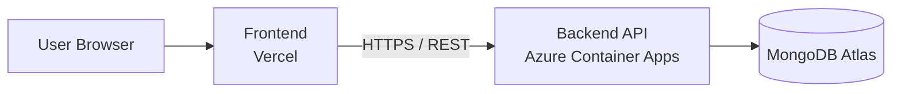
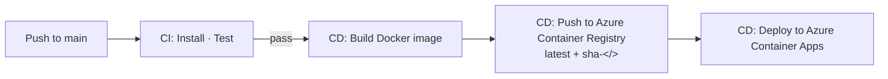

# Kiray

---

<!-- PLACEHOLDER: Demo video

     
-->

---

## Product

### Who it's for

Kiray is built for **renters and landlords in Addis Ababa,** urban dwellers who are searching for a direct, commission-free way to connect with one another, without relying on brokers, intermediaries, or opaque rental markets.

### What Is built

I designed, built, tested, and deployed the complete full-stack application as a solo project: a Next.js 15 frontend, a Node.js/Express 5 REST API, a MongoDB Atlas persistence layer with native geospatial indexing, and a fully automated GitHub Actions CI/CD pipeline deploying to Azure Container Apps and Vercel.

### The problem

The rental market in Addis Ababa imposes significant friction on both sides of every transaction:

1. Both renters and landlords are compelled to engage brokers, incurring fees that frequently exceed one month's rent with no guarantee of a successful match.
2. Landlords routinely leave properties vacant for months because they lack a direct, scalable channel to reach prospective tenants independently.
3. Renters who secure a property through an intermediary receive no verified information about the landlord or the listing, creating conditions for misrepresentation and disputes.
4. Once a property is found, navigating to an unfamiliar address in a city with inconsistent street naming conventions remains a meaningful practical barrier.
5. There is no centralised, trustworthy platform where landlords can self-list properties and renters can browse, filter, and evaluate options without an intermediary.

### The solution

1. Landlords can list their properties for free in minutes with photos, pricing, and direct contact details without a broker or commission.
2. Renters can browse, filter, and bookmark listings for free, contacting landlords directly through the channels displayed on each listing page.
3. An interactive map surface allows renters to explore available properties by neighbourhood and navigate directly to a listing's real-world location.
4. Verified star ratings and written community reviews provide the trust signals that a broker's word-of-mouth reputation would otherwise supply.
5. An administrative control plane ensures listing quality through verification badges, content moderation queues, and automated policy enforcement.

### Key features

- **Map-first discovery** An interactive Mapbox GL map is the primary browsing surface. Renters explore listings visually by neighbourhood, using bounding-box and proximity radius searches.
- **Advanced compound filtering** Filter simultaneously by price range, bedroom and bathroom count, property type (apartment, house, villa, studio, room, and more), square footage, and amenity checkboxes. All filter state serialises into deep-linkable URL parameters.
- **Direct landlord contact** Phone, WhatsApp, and email channels are displayed directly on every listing page. There is no in-app messaging silo, no scheduling bottleneck.
- **Role-driven dashboards** The interface adapts entirely to the authenticated user's role: renters manage saved listings, landlords manage their property portfolio and listing lifecycle, and administrators govern the platform through a dedicated control plane.
- **Saved listings (favourites)** Renters can bookmark any listing from the browse page or listing detail page, with instant cache invalidation on the saved set.
- **Verified ratings and per-listing reviews** Authenticated users submit star ratings (1–5) and written comments. Average rating and review count are maintained atomically on the listing document and displayed on both cards and detail pages.
- **Administrative control plane** Moderation tools include user lifecycle management, listing verification and featured-promotion toggles, citizen report resolution, an immutable audit log, and runtime system configuration (registration toggles, listing caps, maintenance mode).
- **English and Amharic internationalisation** A custom `LanguageContext` provider supports full UI language switching at runtime, with `Noto Sans Ethiopic` font support for correct Ethiopic script rendering.

### Try it yourself

Check it Live on **[Kiray](https://kiray-one.vercel.app)**:

| Role         | Email                     | Password     |
| :----------- | :------------------------ | :----------- |
| **Landlord** | `landlord@demo.kiray.app` | `Demo@12345` |
| **Rentee**   | `rentee@demo.kiray.app`   | `Demo@12345` |

---

## Technical Breakdown

### Architecture overview

The frontend is deployed to Vercel and communicates with the backend exclusively over HTTPS using Firebase-issued Bearer tokens. The backend runs as a containerised Node.js application on Azure Container Apps and connects to a MongoDB Atlas cluster for all persistence.

### Engineering highlights

| Layer            | Tech                                                                                                                     |
| ---------------- | ------------------------------------------------------------------------------------------------------------------------ |
| **Frontend**     | Next.js 15 · React 19 · TypeScript 5 · Redux Toolkit v2 + RTK Query · Tailwind CSS v4 · Motion v12 · Vitest v3           |
| **Backend**      | Node.js 20 · Express 5 · ESM · Layered Architecture (Routes → Controllers → Services → Models) · Jest v30 + Supertest v7 |
| **Database**     | MongoDB Atlas · Mongoose 9 · `2dsphere` geospatial indexes · compound search and filter indexes                          |
| **Infra**        | Docker multi-stage build · Azure Container Registry · Azure Container Apps                                               |
| **Hosting (FE)** | Vercel automatic deploy on merge to `main`                                                                               |
| **CI/CD**        | GitHub Actions two independent pipelines (`frontend-ci.yml`, `backend-ci.yml`)                                           |

Beyond the stack, four engineering decisions merit specific attention:

- **Tag-based RTK Query cache invalidation** eliminates all manual refetch logic across nine independent feature slices. Every mutation declares the cache tags it invalidates; RTK Query handles the rest automatically.
- **Strict controller–service separation** in the backend means controllers are pure HTTP adapters they unpack request parameters and format responses, but contain zero business logic. All domain rules, geospatial queries, and rating aggregations live in isolated service functions, making the service layer fully unit-testable without an HTTP server.
- **MongoDB `2dsphere` geospatial indexing** enables native spherical `$near` and `$geoWithin` queries over the listing dataset, powering the map's radius and bounding-box search without any application-level distance calculation.
- **Fully automated backend deploy pipeline** a push to `main` triggers the Jest suite, builds a multi-stage Docker image, tags it with both `latest` and the commit SHA (`sha-<7>`), pushes to Azure Container Registry, and deploys a new revision to Azure Container Apps via `az containerapp update`. A separate `workflow_dispatch` rollback job can redeploy any previously pushed SHA-tagged image without rebuilding.

### Deeper dives

- 📘 [Frontend README](./kiray-client/README.md) architecture, feature modules, state management, routing, and local setup
- 📗 [Backend README](./kiray-server/README.md) layered architecture, API documentation, data models, security, and Docker deployment

---

### Key engineering decisions & trade-offs

#### Why MongoDB?

- **Why:** Rental listings are naturally heterogeneous; studios, villas, and shared rooms require varying attribute sets that MongoDB's document model handles without null-padded columns. Furthermore, native `2dsphere` indexes handle spatial radius and bounding-box queries directly in the database without custom geometry math.
- **Trade-off:** No database-enforced foreign keys. Referential integrity is maintained at the application level via Mongoose validators and soft deletes, and multi-entity queries require `$lookup` aggregation pipelines.

#### Why a layered architecture in the backend?

- **Why:** Enforces a strict separation of **Routes → Controllers → Services → Models**. Controllers are thin HTTP adapters that parse inputs and format responses; all business logic, geospatial filtering, and rating calculations live in services. This keeps the core domain isolated and fully unit-testable without spinning up an HTTP server.
- **Trade-off:** Increases boilerplate. Even straightforward CRUD endpoints require touching controllers, services, and models, which can feel heavy for small features.

#### Why a feature-based architecture in the frontend?

- **Why:** Code is grouped into domain slices (`src/features/`), each co-locating its RTK Query endpoints, state slice, hooks, and UI components. Cross-feature imports are restricted to shared modules (`src/components/`, `src/lib/`), making ownership clear and preventing tight coupling across distinct areas.
- **Trade-off:** Produces higher directory depth and more file hopping than a flat page-centric or simple component structure.

#### Why Redux Toolkit?

- **Why:** Kiray's experience is role-driven (`rentee`, `landlord`, `admin`), requiring authentication tokens, user profiles, and synchronized map/card list states to be shared across deeply nested layouts. RTK provides predictable state updates, strong typing, and time-travel DevTools for these cross-cutting concerns.
- **Trade-off:** More upfront setup and conceptual overhead compared to lighter alternatives like Zustand or React Context.

#### Why RTK Query?

- **Why:** Integrates natively with the Redux store to provide declarative data fetching, deduplication, and automated tag-based cache invalidation (e.g., listing edits instantly invalidate search and card caches without manual refetch calls). A shared `baseApi` handles Firebase token injection transparently for all nine feature slices.
- **Trade-off:** Locked into the Redux ecosystem; carries a steeper learning curve and less portability than framework-agnostic solutions like TanStack Query.

#### Why Azure Container Apps?

- **Why:** Delivers container-native deployment with scale-to-zero pricing, eliminating idle hosting costs during early project phases. It removes Kubernetes (AKS) cluster management overhead while providing revision management, automated traffic routing, and co-location with Azure Container Registry.
- **Trade-off:** Less low-level infrastructure and network control than a self-managed AKS cluster.

---

### Security & authentication

- **Authentication** Firebase Client SDK issues ID tokens (JWTs) on sign-in. The backend verifies every token using the Firebase Admin SDK before any protected route is reached. Tokens are stored in the Redux `authSlice`; the RTK Query `baseApi` `prepareHeaders` function attaches the current token as a `Bearer` credential on every outbound request, with a `getCurrentIdToken()` fallback for post-reload re-hydration when the Redux store has not yet been rehydrated.
- **API protection** All request bodies, query strings, and route parameters are validated through declarative Zod schemas before reaching controllers. Tiered rate limiting is enforced via `express-rate-limit`: a global limiter (100 requests per 15-minute window), a stricter auth limiter for `/api/v1/auth/*` to mitigate brute-force attempts, and a separate upload limiter for image endpoints. `express-mongo-sanitize` prevents NoSQL injection on all user-supplied payloads. Helmet enforces HTTP security headers (CSP, HSTS, X-Frame-Options, XSS filtering) on every response.
- **Secrets management** The Firebase service account JSON is injected as an environment variable (`FIREBASE_SERVICE_ACCOUNT`). All other secrets database URIs, Cloudinary credentials, Mapbox tokens are injected at runtime via Azure Container Apps environment secrets (backend) and Vercel project settings (frontend). No secrets are committed to source control.

---

### Testing

| Part         | Framework                          | Test Suites | Tests |
| ------------ | ---------------------------------- | ----------- | ----- |
| **Frontend** | Vitest v3 + @testing-library/react | 88          | 367   |
| **Backend**  | Jest v30 + Supertest v7            | 34          | 230   |

**Frontend tests** cover: Redux `authSlice` state transitions (`setCredentials`, `logout`, `resetAuth`); RTK Query `baseApi` tag invalidation and cache behaviour across all feature slices; Zod form validation schemas; and UI component rendering and interaction (listing cards, filter panels, modals, dashboards).

**Backend tests** cover: HTTP security hardening (Helmet headers, rate limiter enforcement, NoSQL sanitization); Firebase authentication and role-based access control; geospatial radius and bounding-box search; listing CRUD lifecycle, slug generation, and Cloudinary media processing; review aggregation and bookmark counter updates; and the complete administrative control plane including moderation resolution workflows and audit log generation.

End-to-end browser tests and load/performance tests are not included in this suite. The API integration tests written with Supertest cover the full HTTP request-response cycle including middleware, which was judged to provide sufficient coverage of the critical paths for this project phase.

---

### CI/CD & deployment

#### Frontend Vercel

Vercel deploys the frontend automatically on every merge to `main`. The GitHub Actions `frontend-ci.yml` pipeline runs independently on every push or pull request touching `kiray-client/**`, executing the full quality gate before Vercel picks up the merge:

1. TypeScript type-check (`tsc --noEmit`)
2. ESLint
3. Vitest test suite (367 tests)
4. Next.js production build

Vercel project secrets (Firebase keys, Mapbox token, API URL) are injected at build time. Stub values are provided to the CI environment via GitHub Actions secrets so that the Next.js build does not fail on missing environment variables during the pipeline run.

#### Backend Azure

The `backend-ci.yml` pipeline triggers on every push or pull request touching `kiray-server/**`:

1. **Test** Jest suite (230 tests) runs with coverage; coverage artifact is uploaded and retained for 14 days.
2. **Docker build** _(on merge to `main` only)_ Multi-stage Docker image is built and pushed to Azure Container Registry, tagged with both `latest` and `sha-<7>` (short commit SHA).
3. **Deploy** `az containerapp update` deploys the new SHA-tagged image revision to Azure Container Apps.
4. **Rollback** A separate `workflow_dispatch` job accepts a SHA input and redeploys the corresponding ACR image without rebuilding or re-running tests.

All Azure credentials (`AZURE_CREDENTIALS` service principal, `ACR_REGISTRY`, `AZURE_CONTAINER_APP_NAME`, `AZURE_RESOURCE_GROUP`) are stored as GitHub Actions secrets scoped to the `production` environment, which requires explicit approval for deployment jobs.
